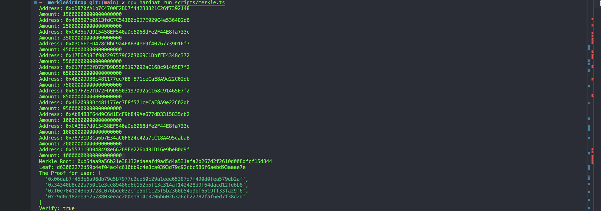

# Merkle Airdrop Smart Contract
### Overview
The goal of this project is to implement a smart contract for an airdrop using a Merkle tree to whitelist eligible addresses. This project demonstrates how to generate a Merkle root from a list of eligible addresses, implement a Solidity smart contract that verifies claims against this Merkle root, and manage the airdrop process. By completing this project, students will gain practical experience in Solidity programming, Merkle tree construction, and smart contract testing using Hardhat.

### Project Structure
CSV File: Contains a list of addresses and the corresponding amount of tokens each address is eligible to receive.
Merkle Tree Script (merkle.ts): This script generates the Merkle root from the provided CSV file.

Solidity Contract (MerkleAirdrop.sol): The smart contract that manages the airdrop process and verifies claims using Merkle proofs.
Test Suite: A set of tests written using Hardhat to ensure the correctness of the smart contract.

<!-- imnage -->
Verifying the Merkle proof for an address to claim tokens from the airdrop.



## Getting Started
## Prerequisites
Node.js: Ensure that Node.js is installed on your system.
Hardhat: A development environment for compiling, deploying, testing, and debugging Ethereum software.
Ethers.js: A library used for interacting with the Ethereum blockchain.
merkletreejs: A library to generate Merkle trees and proofs.
keccak256: A hashing function used for generating leaves in the Merkle tree.

Follow the steps below to set up the project on your local machine:

```shell
git clone <repository-url>
cd merkle-airdrop
npm install

npx hardhat testaddress,amount
0x123...abc,100
0x456...def,200

npx hardhat run src/merkle.ts

npx hardhat compile

npx hardhat run scripts/deploy.ts --network <network-name>


npx hardhat test

```
